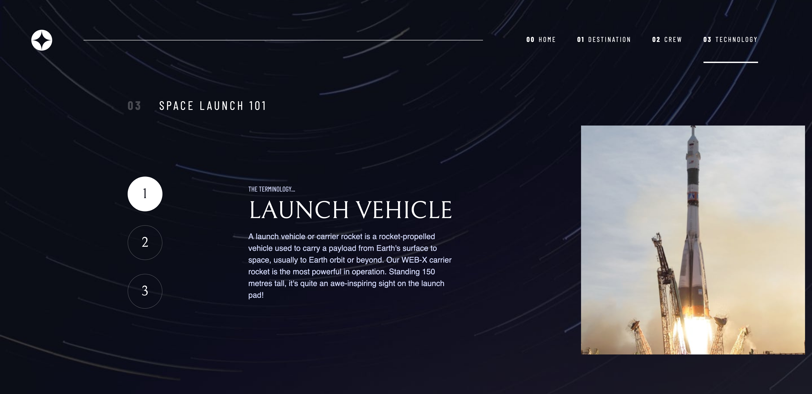

# Frontend Mentor - Space tourism website solution

This is a solution to the [Space tourism website challenge on Frontend Mentor](https://www.frontendmentor.io/challenges/space-tourism-multipage-website-gRWj1URZ3).

## Table of contents

- [Overview](#overview)
  - [The challenge](#the-challenge)
  - [Screenshot](#screenshot)
  - [Links](#links)
- [My process](#my-process)
  - [Built with](#built-with)
  - [What I learned](#what-i-learned)
  - [Continued development](#continued-development)
  - [Useful resources](#useful-resources)
- [Author](#author)
- [Acknowledgments](#acknowledgments)

## Overview

### The challenge

Users should be able to:

- View the optimal layout for each of the website's pages depending on their device's screen size
- See hover states for all interactive elements on the page
- View each page and be able to toggle between the tabs to see new information

### Screenshot




### Links

- Solution URL: [Click here](https://github.com/Antonio0402/space-tourism-website)
- Live Site URL: [Click here](https://your-live-site-url.com)

## My process

### Built with

- Semantic HTML5 markup with BEM structure
- CSS custom properties
- Flexbox
- CSS Grid
- Mobile-first workflow
- Vanilla JavaScript

### What I learned

- Building a web system design by using CSS custom properties
- Be familiar with CSS Grid and put it to work as a helper class for multipage
- A better way to initiate contents for tab menu when using aria and data attribute rather overdo the classname
- How to i src attribute of image tag by using the resize event of window:

```js
window.addEventListener('resize', () => {
  const index = techImg.findIndex((image) => image.style.visibility === 'visible');
  const img = techImg[index].firstElementChild;
  console.log(img);
  const portraitUrl = img.src.replace('landscape', 'portrait');
  const landscapeUrl = img.src.replace('portrait', 'landscape');
  if(window.innerWidth >= 900) {
    img.src = portraitUrl;
  } else {
    img.src = landscapeUrl;
  }
});
```

- How to read current browser window URL and using that output to trigger active property

```js
const links = [...nav.getElementsByTagName('li')];

links.forEach((link) => {
  link.classList.remove('active');
  /* take the name of page in the href by slicing from the position of last character '/' to the last character '.' */
  const slash = link.firstElementChild.href.lastIndexOf('/');
  const dot = link.firstElementChild.href.lastIndexOf('.');
  const page = link.firstElementChild.href.slice(slash + 1, dot);
  if(window.location.href.indexOf(page) != -1) {
    link.classList.add('active');
  }
});
```

### Continued development

- There 're should be a better way to retrieve data for the page's contents by leverage the JSON data file which I am intend to learn more in the future projects.

### Useful resources

- [Kevin Powell - YouTube channel](https://www.youtube.com/channel/UCJZv4d5rbIKd4QHMPkcABCw)
- [Create a Design System with CSS](https://www.youtube.com/watch?v=lRaL-8qZ0mM)
- [W3School - Same as MDN](https://www.w3schools.com/)

## Author

- Frontend Mentor - [@Antonio0402](https://www.frontendmentor.io/profile/Antonio0402)

## Acknowledgments

So much thanks specially to Kevin Powel Youtube Chanel for helping me get through this project as well as being simplified complicated and confusing CSS's topic related to Flexbox and Grid.
